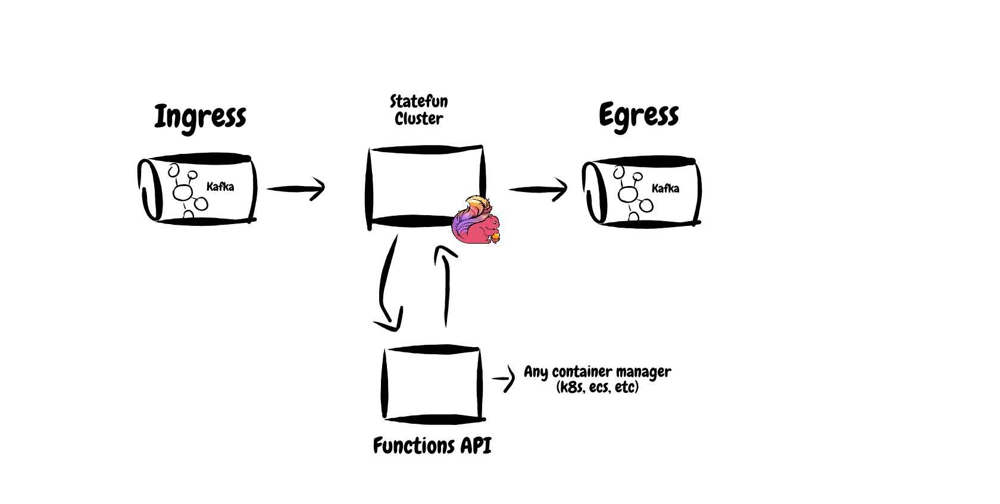

## Flink in Scala 3!

This is a PoC using StateFun's remote Java sdk wrapped in Scala 3.0.0-RC2.
A very basic tweet-impression counter is implemented. 

For lack of a suitable web application framework in Scala 3 at the time of writing, 
Undertow is used.

The architecture of the system is depicted below:

Statefun is magic. All system integrations and network calls are abstracted and handled by the framework. 
The developer simply has to implement a `Request => Response` function. 
That said, this complexity is still lingering around in the form of configuration files.

If this was ever to be used in production I would start by creating a DSL to compose 
`module.yaml` in a typesafe way in Scala.